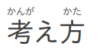

# React Furi

> Good Lookin' Furigana

[](https://www.npmjs.com/package/react-furi)
[](https://npm-stat.com/charts.html?package=react-furi&from=2016-04-01)
[](https://travis-ci.org/DJTB/react-furi)
[](https://codecov.io/github/DJTB/react-furi)
<br />
[](http://commitizen.github.io/cz-cli/)
[](https://github.com/prettier/prettier)
[](./code_of_conduct.md)

## REPO is WIP

Component extracted from a production site.
Currently missing from repo:

* bundling
* render tests
* NPM publish
* example demo
* plain css => removal of styled-components as dependency

## Why?

The [Ruby](https://developer.mozilla.org/ja/docs/Web/HTML/Element/ruby) element often has less than ideal rendering. This React component allows you to use furigana data from [JmdictFurigana](https://github.com/Doublevil/JmdictFurigana) to render only the necessary readings over their respective characters. Also allows better styling control of your furigana, props to easily show/hide furigana, and fallbacks to render similarly to Ruby tags, but without unnecessary trailing [okurigana](https://en.wikipedia.org/wiki/Okurigana).

<!--
## Installation

```sh
npm install --save react-furi
```

## Demo

[Examples](https://djtb.github.io/react-furi)
-->

## Usage

```js
import ReactFuri from 'react-furi';
const MyComponent = () => <ReactFuri word="考え方" furi="0:かんがえ;2:かた" />;
```



## Related

* [JmdictFurigana](https://github.com/Doublevil/JmdictFurigana) : Furigana dictionary
* [Wanakana](https://github.com/WaniKani/WanaKana) : Japanese romaji <-> kana transliteration
* [Hatsuon](https://github.com/DJTB/hatsuon) : Japanese pitch accent tools

## Contributors

Thanks goes to these people ([emoji key](https://github.com/kentcdodds/all-contributors#emoji-key)):

<!-- ALL-CONTRIBUTORS-LIST:START - Do not remove or modify this section -->

<!-- prettier-ignore -->
| [<br /><sub><b>Duncan Bay</b></sub>](https://github.com/DJTB)<br />[💻](https://github.com/DJTB/react-furi/commits?author=DJTB "Code") [📖](https://github.com/DJTB/react-furi/commits?author=DJTB "Documentation") [🚇](#infra-DJTB "Infrastructure (Hosting, Build-Tools, etc)") [🎨](#design-DJTB "Design") |
| :---: |

<!-- ALL-CONTRIBUTORS-LIST:END -->

This project follows the [all-contributors](https://github.com/kentcdodds/all-contributors) specification. Contributions of any kind welcome!

## License

MIT &copy; [Duncan Bay](https://github.com/DJTB)
